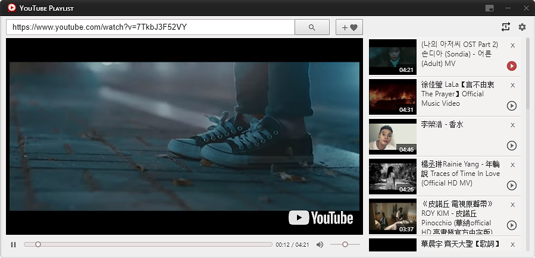
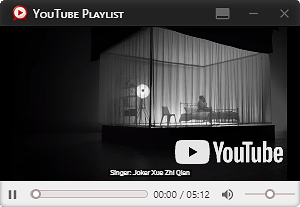

#  **YouTube-Playlist**


<div align="center">


</div>

* **Based on Electron, React to build Desktop application**

## Introduction

No Ads, let's play your favorite YouTube videos looply easier.

Miniplayer supported, so playing it all day on your screen.





This is now version: **0.7.0**

many new features could be added.

**Welcome any suggestions or PR to me.**

## Getting Started

**This project developed based on Electron-React-Boilerplate**


### Install

First, clone the repo via git:

```bash
git clone https://github.com/cchoici/youtube-playlist.git
```

And then install dependencies with yarn.

```bash
$ cd your-project-name
$ yarn
```
If it occurs errors on installing, maybe you should try:

```bash
$ cd your-project-name
$ npm run install
```

### Run

```bash
$ npm run dev
```

### Packaging

To package apps for the local platform:

Right now app is workable to run on window platform.

No opportunity to test on other platforms.

```bash
$ npm run package-win
```

## Authors

* **Hou-Hsi Lee**

## License

This project is licensed under the MIT License
